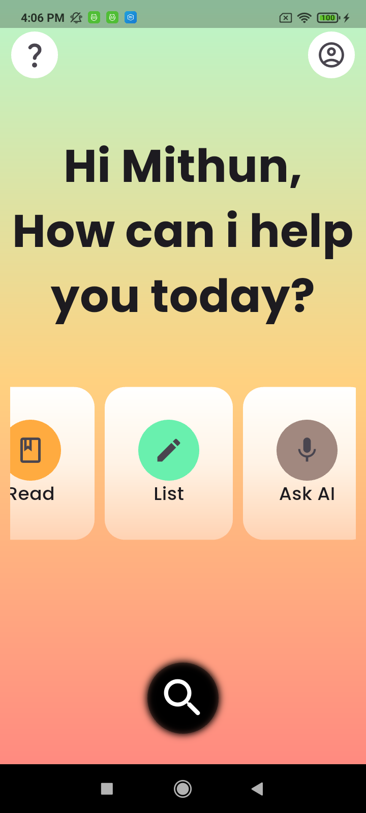

# 📄 Document Scanner App

A beautifully designed, modern Flutter application built with a focus on fluid animations and premium user experience. This project features a completely custom, curved carousel wheel UI inspired by top-tier Dribbble designs.

## ✨ UI Preview

Here is a look at the custom home screen and interactions:

<p align="center">
  
  &nbsp;&nbsp;&nbsp;&nbsp;
  
</p>

## 🚀 Key Features

* **Custom Curved Carousel:** Utilizes `PageView` combined with `AnimatedBuilder` and a deeply shifted `Transform` alignment to create a natural, sweeping wheel effect without complex trigonometry.
* **Bespoke Card Geometry:** Features a `CustomClipper` to generate uniquely tapered, petal-shaped cards that mimic an organic, ergonomic feel.
* **Premium Aesthetics:** Implements soft gradient backgrounds, frosted-glass inspired elements, and Google Fonts for a highly polished, modern look.
* **Responsive Layout:** Built to scale beautifully across different device sizes.

## 🛠️ Built With

* **Framework:** [Flutter](https://flutter.dev/)
* **Typography:** [google_fonts](https://pub.dev/packages/google_fonts)

## 🗂️ Project Highlights

The magic of the UI happens in two main components:
1.  **`Homescreen`:** Manages the `PageController` and the `Transform.rotate` logic with an offset alignment `Alignment(0, 3.0)` to push the rotation pivot point off-screen.
2.  **`CustomCard` / `WedgeClipper`:** Draws the exact geometry of the tapered cards with smooth quadratic Bezier curves.

## 🏁 Getting Started

To run this project locally, ensure you have Flutter installed on your machine.

**1. Clone the repository**
```bash
git clone https://github.com/mithun00gowda/documentsScanner
cd documentscanner